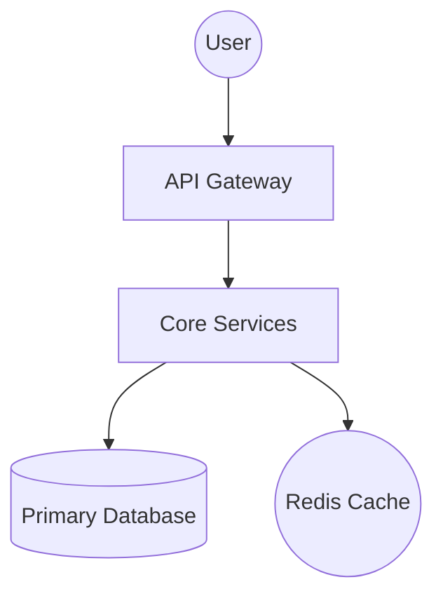

# 🏗️ Architecture: {project_name}

## High-Level Vision

This document outlines the architectural patterns and service boundaries of the {project_name} ecosystem.

## Component Overview

## Service Boundaries

| Component | Responsibility | Tech Stack |
| :--- | :--- | :--- |
| **API** | Request routing & Auth | {stack} |
| **Worker** | Background processing | {stack} |
| **Storage** | Persistence | Postgres |

## Information Flow

1. User authenticates via API.
2. API validates schema and dispatches to Core Services.
3. Services interact with DB/Cache for state management.
